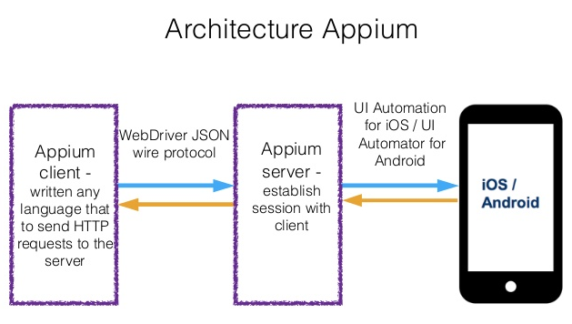

# WebAppium
A simple ready to use mobile web app automation framework with Appium. This a maven project for automating the Test Scenarios across Android Mobile Chrome application to perform features testing using BBD Style framework followed by Page OBJECT Model Architecture.

### What is Appium?
Appium is an open-source test automation framework for use with native, hybrid and mobile web apps. 
It drives iOS, Android, and Windows apps using the WebDriver protocol.




<br>

## Usage in in the code

```java
@BeforeClass
    public void setUp() throws MalformedURLException {
        DesiredCapabilities caps = new DesiredCapabilities();
        caps.setCapability("automationName" , "uiautomator2");
        caps.setCapability("platformName" , "Android");
        caps.setCapability("platformVersion" , "8.1.0");
        caps.setCapability("deviceName" , "Android");
       
    }
```

<br>

## Licence

The project is released under the [MIT License](LICENSE).
